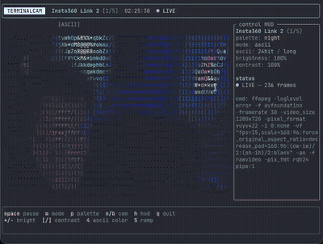

# 📹 tambocam

**A terminal camera monitor built with Java and [TamboUI](https://github.com/tamboui/tamboui).**

Live camera feed rendered directly in your terminal — ASCII art, half-block pixels, or braille dots. Compact camera-monitor HUD with interactive controls for brightness, contrast, color tints, and render modes.

## Install & Run

```bash
jbang app install tambocam@maxandersen/tambocam
tambocam
```

> Don't have JBang? `curl -Ls https://sh.jbang.dev | bash` or `brew install jbang`



[▶ Full quality video (demo.mp4)](https://github.com/maxandersen/tambocam/raw/main/demo.mp4)

> [!NOTE]
> **This project is inspired by and pays tribute to [terminalcam](https://gitlab.com/here_forawhile/terminalcam) by [here_forawhile](https://gitlab.com/here_forawhile).** The original terminalcam is a brilliant single-file Python tool that renders live ASCII art from your webcam. We loved the idea and wanted to explore what it would look like built on a Java TUI framework. This is a recreation, not a fork — all code is original, but the concept, UX direction, and "terminal as camera monitor" philosophy come directly from the original. Go check it out and give it a star.

---

## ✨ Features

- **Live camera feed** — real-time webcam capture via ffmpeg
- **Three render modes** — half-block pixels, braille dots, and ASCII art with character ramps
- **Auto-detection** — probes camera capabilities (resolution, framerate) and picks the best mode automatically
- **Color depth control** — 24-bit, 256-color, 16-color, grayscale, green night-vision, or plain ASCII
- **Image adjustments** — brightness, contrast, and color palette tints (night, amber, ice)
- **Camera switching** — discover and cycle through available cameras at runtime
- **Multiple sources** — live camera, still images, animated GIFs, or image directories
- **Cross-platform camera** — macOS (avfoundation), Linux (v4l2), Windows (dshow)
- **Auto camera on startup** — detects and starts the first available camera; falls back to synthetic if none found
- **Snapshot export** — press `s` to save PNG (raw frame) + SVG (terminal rendering) via TamboUI's built-in export
- **Synthetic test pattern** — animated camera-style test feed as fallback when no camera is available
- **Compact HUD** — camera-monitor-style overlay with live status, sliders, and flash notifications
- **Zero build tools** — runs directly with [JBang](https://www.jbang.dev/), no Gradle/Maven needed

## 📋 Requirements

| Dependency | Required | Notes |
|------------|----------|-------|
| **Java 8+** | Yes | Runtime (JBang handles this) |
| **[JBang](https://www.jbang.dev/)** | Yes | Runs the app — no build step needed |
| **[ffmpeg](https://ffmpeg.org/)** | For camera | Camera capture; not needed for synthetic/image modes |

### Installing dependencies

```bash
# JBang (macOS)
brew install jbang
# or: curl -Ls https://sh.jbang.dev | bash

# ffmpeg (macOS)
brew install ffmpeg

# ffmpeg (Linux)
sudo apt install ffmpeg    # Debian/Ubuntu
sudo dnf install ffmpeg    # Fedora

# ffmpeg (Windows)
winget install ffmpeg
```

## 🚀 Quick Start

```bash
# Clone and run — auto-detects camera, falls back to synthetic
git clone https://github.com/maxandersen/tambocam.git
cd tambocam
jbang tambocam

# Force specific camera
jbang tambocam --camera

# List available cameras
jbang tambocam --list-cameras

# Specific camera device
jbang tambocam --camera=1

# Display a still image, GIF, or directory of frames
jbang tambocam photo.png
jbang tambocam animation.gif
jbang tambocam ./frames/
```

Or run directly from GitHub without cloning:

```bash
jbang tambocam@maxandersen/tambocam
jbang tambocam@maxandersen/tambocam --camera
```

## 🎮 Controls

### General

| Key | Action |
|-----|--------|
| `m` | Cycle render mode: half-block → braille → ASCII |
| `p` | Cycle color palette: night → amber → ice |
| `+` / `-` | Adjust brightness |
| `[` / `]` | Adjust contrast |
| `SPACE` | Pause / resume |
| `n` / `b` | Next / previous camera (or frame for static sources) |
| `s` | Save snapshot (PNG + SVG) |
| `h` | Toggle HUD overlay |
| `q` | Quit |

### ASCII mode (press `m` until ASCII)

| Key | Action |
|-----|--------|
| `4` | Cycle color depth: 24bit → 256c → 16c → gray → green → off |
| `5` | Cycle character ramp: long (70 chars) → short (10 chars) |

> **Tip:** Lower color depths (256c, 16c) render smoother because fewer unique colors means less terminal output per frame.

## 🏗️ Architecture

```
tambocam/
├── jbang-catalog.json           # JBang alias
├── README.md
└── src/
    ├── TamboCamDemo.java     # Entry point, event loop, rendering
    ├── FrameSource.java         # Interface for frame sources
    ├── FrameSources.java        # Factory: CLI args → FrameSource
    ├── FfmpegCameraFrames.java  # Live camera via ffmpeg (probe + capture)
    ├── SyntheticCameraFrames.java  # Animated test pattern generator
    ├── CameraDevice.java        # Camera discovery (avfoundation/v4l2)
    └── AsciiArtRenderer.java    # ASCII art with character ramps + color
```

### How it works

```
┌─────────────┐     raw RGB24      ┌──────────────┐     Buffer     ┌──────────┐
│   ffmpeg     │ ──────────────────▶│  FrameSource  │ ────────────▶│ Terminal  │
│  (camera)    │  background thread │  (ImageData)  │  TamboUI     │  (diff)   │
└─────────────┘                    └──────────────┘  render        └──────────┘
```

1. **Camera probe** — runs ffmpeg with intentionally unsupported settings to discover supported resolutions and framerates, then picks the smallest usable mode
2. **Raw RGB24 capture** — ffmpeg pipes raw pixels (no PNG encode/decode), matching [terminalcam's approach](https://gitlab.com/here_forawhile/terminalcam) for maximum throughput
3. **Background frame reader** — a daemon thread continuously reads complete frames and atomically updates the latest frame reference
4. **Render loop** — the main thread polls for input (8ms timeout), applies image adjustments, and renders via TamboUI's buffer system
5. **Buffer diff** — TamboUI diffs the current frame against the previous one and only sends changed cells to the terminal
6. **Snapshot export** — press `s` to save the raw frame as PNG and the terminal rendering as SVG using TamboUI's built-in `export(buffer).toFile()` API

### Frame sources

| Source | Description |
|--------|-------------|
| `SyntheticCameraFrames` | Animated test pattern with scan lines, crosshair, pulsing record dot |
| `FfmpegCameraFrames` | Live camera via ffmpeg — auto-probes modes, reads raw RGB24 |
| `FrameSources.still()` | Single image file (PNG, JPEG, WebP, BMP) |
| `FrameSources.gif()` | Animated GIF — extracts all frames |
| `FrameSources.directory()` | Cycles through image files in a directory |

### Render modes

| Mode | Method | Resolution |
|------|--------|------------|
| **Half-block** | `▀▄` characters with fg/bg color | 2 pixels per cell vertically |
| **Braille** | Unicode braille dots | ~2×4 pixels per cell |
| **ASCII** | Character ramp by brightness | 1 character per cell, with color |

### Camera auto-detection

Instead of hardcoding resolution and framerate (which fails on many cameras), tambocam probes the device:

```
1. Run: ffmpeg -f avfoundation -framerate 1 -video_size 1x1 -i 0:none ...
2. ffmpeg fails but prints:
     Supported modes:
       1280x720@[30.000030 30.000030]fps
       1920x1080@[30.000030 30.000030]fps
       3840x2160@[24.000038 24.000038]fps
3. Parse modes → pick smallest resolution ≥ 160×96
4. Start capture with: -video_size 1280x720 -framerate 30
```

## 🔧 Platform support

| Platform | Capture format | Device input | Camera discovery |
|----------|---------------|-------------|-----------------|
| **macOS** | avfoundation | `N:none` | `ffmpeg -list_devices` |
| **Linux** | v4l2 | `/dev/videoN` | scan `/dev/video*` + `v4l2-ctl` |
| **Windows** | dshow | `video=N` | manual `--camera=N` |

## 🙏 Credits

- **[terminalcam](https://gitlab.com/here_forawhile/terminalcam)** by [here_forawhile](https://gitlab.com/here_forawhile) — the original inspiration. A beautiful single-file Python ASCII camera for the terminal. The concept, UX philosophy, character ramps, and "terminal as camera monitor" direction all come from this project.
- **[TamboUI](https://github.com/tamboui/tamboui)** — the Java TUI framework powering the rendering, layout, and buffer diff system.
- **[JBang](https://www.jbang.dev/)** — makes it possible to run Java apps without a build tool.

## 📄 License

MIT
